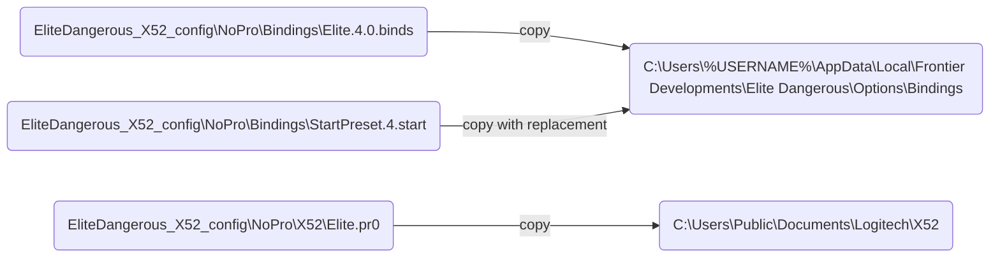

# EliteDangerous_X52_config

## Description

This repository contains my control configuration in the game `Elite Dangerous` for the H.O.T.A.S X52 set from the manufacturer Logitech/Saitek (at the moment for **NoPro** version).

This configuration was created by me based on my personal preferences while playing. It is not final and is constantly being improved as management conflicts arise and new features need to be implemented.

You can modify this configuration to suit your preferences.

I hope this configuration will help first of all beginners and will be a good starting point for finding the ideal settings on your own.

Good luck!

o7 - CMDR Arjum

## Features

## Deploy

To install the control configuration (for OS Windows), you need to place several configuration files from the repository in the game settings directory and the directory of control profiles of the H.O.T.A.S X52 set configuration program.

The order of placing the necessary files is shown in the diagram below.

Where `%USERNAME%` is the name of the current user.

You can also use a script `configure.bat` to automatically copy the necessary files from the repository. This script can be run by double click or via cmd.

## FAQ

**Q:** After installing the configuration according to the instructions in the control settings in the game, I do not see installed control profile. Why?

**A:** The following are possible causes of the problem and how to solve them:

1. Some of the configuration files were not installed in the correct directory. You need to check if the required directories contain the listed files and place the missing ones manually (see the "Deploy" section). If you solved the problem and used the installation script during the initial installation - let me know and I will try to fix it.

2. H.O.T.A.S X52 game controller is not connected. The configuration presented in this repository only works with this game controller, therefore, if there is no connection between H.O.T.A.S X52 and a PC, the desired control profile is not displayed in the game (both by default and in the drop-down list of all control profiles).

