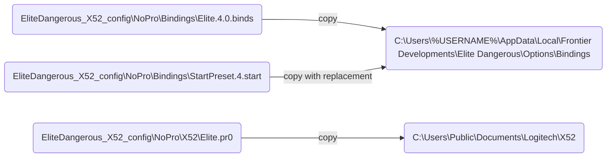

# EliteDangerous_X52_config

## Description

This repository contains my control configuration in the game `Elite Dangerous` for the H.O.T.A.S X52 set from the manufacturer Logitech/Saitek (at the moment for **NoPro** version).

This configuration was created by me based on my personal preferences while playing. It is not final and is constantly being improved as management conflicts arise and new features need to be implemented.

You can modify this configuration to suit your preferences.

I hope this configuration will help first of all beginners and will be a good starting point for finding the ideal settings on your own.

Good luck!

o7 - CMDR Arjum

## Features

## Deploy

To install the control configuration (for OS Windows), you need to place several configuration files from the repository in the game settings directory and the directory of control profiles of the H.O.T.A.S X52 set configuration program.

The order of placing the necessary files is shown in the diagram below.

## FAQ